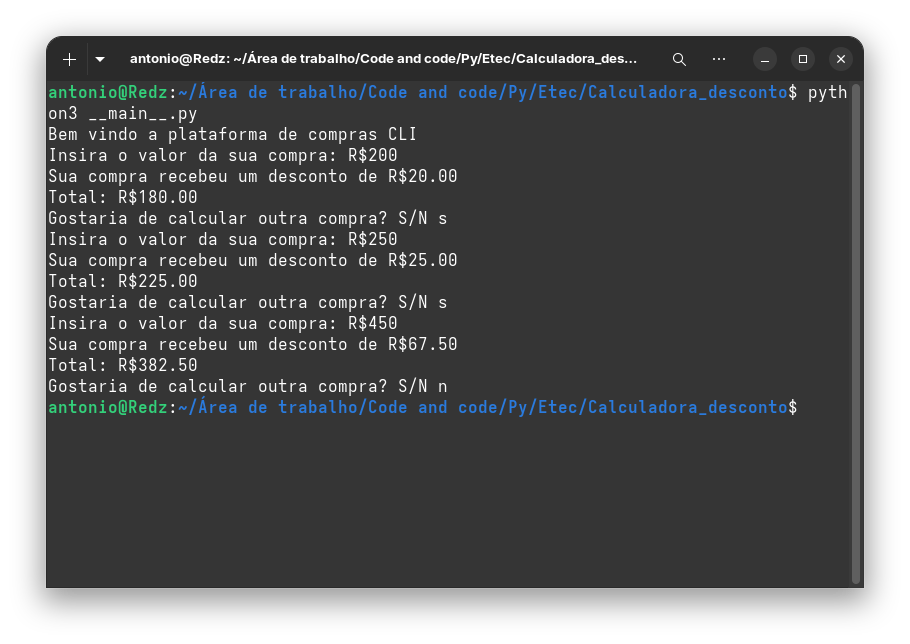

 <div align="center">
 
 

 # Plataforma de Compras CLI

 [](https://www.python.org/)

</div>

Aplicação de linha de comando em Python que calcula o desconto de uma compra e exibe o valor final.


## Regras de desconto

| Valor da compra | Desconto |
|---|---:|
| Inferior a R$ 200,00 | 5% |
| De R$ 200,00 a R$ 299,99 | 10% |
| A partir de R$ 300,00 | 15% |

## Como executar

No terminal, dentro da pasta do projeto, execute:

```bash
python __main__.py
```

Informe o valor da compra quando solicitado. Após o cálculo, escolha `S` para realizar outra compra ou qualquer outra opção para encerrar.
## Print


## Exemplo

```text
Insira o valor da sua compra: R$300
Sua compra recebeu um desconto de R$45.00
Total: R$255.00
```

## Estrutura
```text
semana06/
├── __main__.py
├── Images/
│   └── logo.png
└── README.md
```


